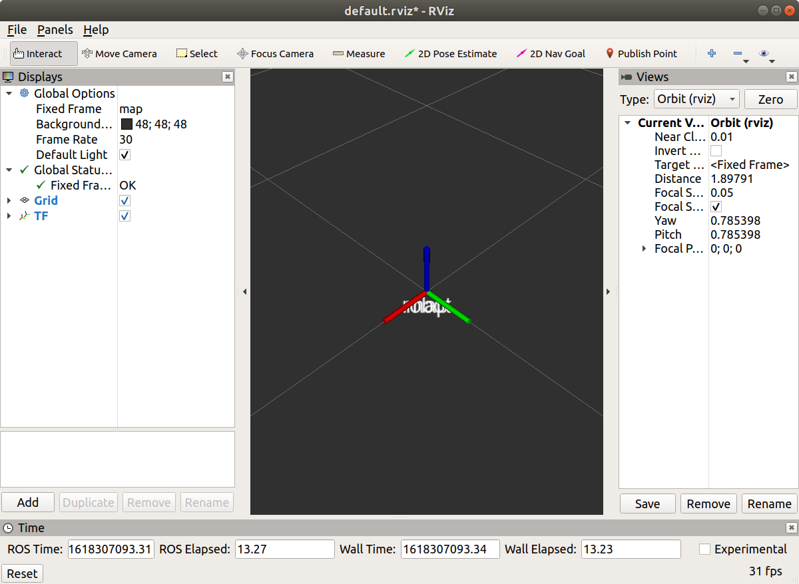
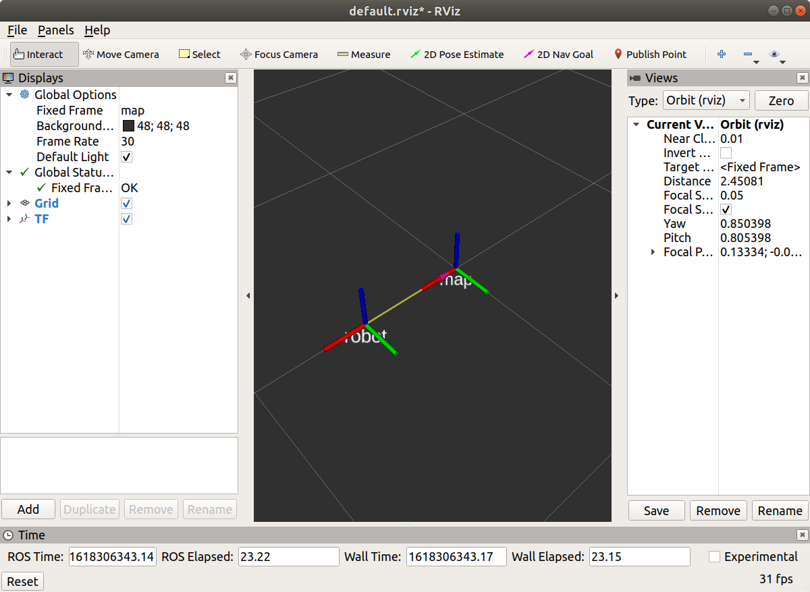
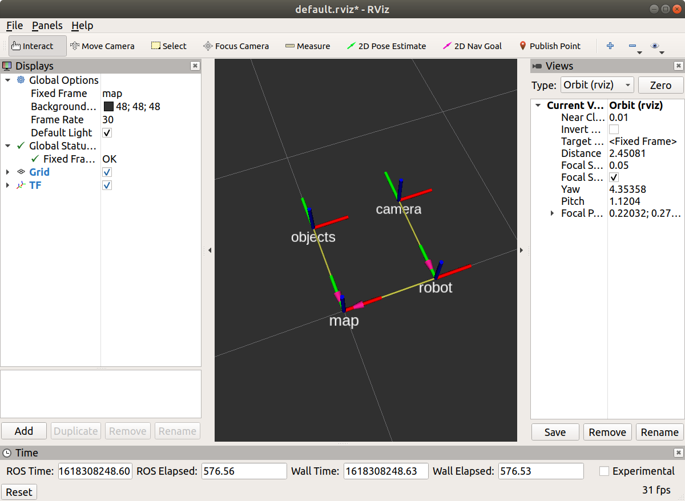
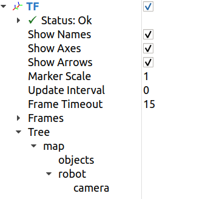
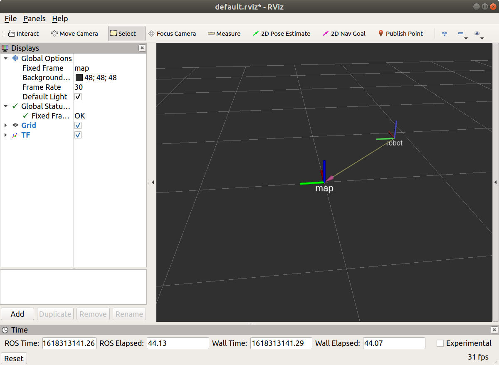

# ros_tf2_sampleのREADME

## 前置き
ROSのTFを扱う（理解）するのに手こずったので，私みたいな人でも触って分かるサンプルを作った．   
まだ未完成なので，よろしく．  
ぶっちゃけ，ソースコードを見れば早いと思う．

---
## 前提

以下の環境で作ったので，試す人はこちらを確認しよう．

- ROS Melodic
  - rosはros-melodic-desktop-fullを入れた．
- Ubuntu 18.04
---
## 導入

初心者のために，導入するところから説明する．  
とりあえず，コピペすればよろしい．

```
cd ~/catkin_ws/src
git clone https://github.com/masausagi/ros_tf2_sample.git
```

その後，コンパイルする．
```
cd ~/catkin_ws
catkin_make
```
エラー文が出たら，適宜対処しよう．  
基本的にはエラー文をgoogleで検索する．  
わからなかったら，issue飛ばしてくれてもいい．日本語でOK．

---
## 使うためのTF知識

このサンプルでは，TFを使うことのみに焦点を当てる．  
だから，本当の知識は得られないので注意すること．  

まず，TFが扱うのは『フレームID』，そして，フレームIDの親子関係である．  

フレームIDとは，色々なデータ（点群とかロボットの位置とか）を表す座標系の名前．  

フレームIDの親子関係とは，Aフレームに乗っかって，Bフレームがあるというイメージ．  
親子関係のことを，ツリー構造と言ったりする．  
例を示す．Aが親で，Bが子供とする．  
AにBが乗っかってる感じをイメージ（抱っこみたいな）  

ここでAは，地図から見て(0,0)から(1,0)に移動した．  
このとき，Bも地図から見て(0,0)から(1,0)に移動しているのだ．（分かる？）  
『地図から見て』というのが重要．  

じゃあ，このとき，『Aから見て』Bはどう映るか？  
というと，Aしか移動してないので，Bは動いていないということになる．

この『○から見て〜〜』の関係を，TFで表せる．

フレーム同士は相対位置で記述できるので，使い勝手がいい．  
今回のサンプルで分かってくれると嬉しい．

---

## サンプル1：TF関係を配信する
TFで，フレームID同士の関係を記述し，配信することで，扱うことができるようになる．

ここで，簡単にTFで遊べるソースを用意したのでぜひ遊んでほしい．  

rosrunでパラメータを設定することで，色々と遊べるようにしている
- pframe (文字列) : 親のフレームIDを指定  
- cframe (文字列) : 子のフレームIDを指定  
- x (小数) : 親から見た子の位置X  
- y (小数) : 親から見た子の位置Y  
- z (小数) : 親から見た子の位置Z  
- qx (小数) : 親から見た子の傾きX  
- qy (小数) : 親から見た子の傾きY  
- qz (小数) : 親から見た子の傾きZ  

### 実行方法

まず，roscoreを立ち上げていない人は立ち上げる

```
roscore
```
そのあと，sample1_tf2_connectionを立ち上げる  
```
rosrun ros_tf2_sample sample1_tf2_connection _x:=0 _y:=0 _z:=0
```
別のターミナルを開き，RVIZを起動する
```
rosrun rviz rviz -f map
```
左下のADDから，TFをセットすると，以下のような画面が出る



フレーム同士が重なって表示される．

### いじってみよう①

このサンプルを利用して，子供のフレームIDを別の場所に移動してみよう．  

一度開いたRVIZとrosrunを閉じて(roscoreはそのまま)以下を実行
```
rosrun ros_tf2_sample sample1_tf2_connection _x:=0.5 _y:=0 _z:=0 
```
RVIZを再度起動
```
rosrun rviz rviz -f map
```


mapとrobotが別れて見やすくなった．

### TF関係を追加しちゃう

このサンプルを利用して，フレームIDの親子関係を複雑にしちゃう．  

以下の例では，こんなTF関係を作成してみる．  
map → robot  
map → objects
robot → camera  

一度開いたRVIZとrosrunを閉じて(roscoreはそのまま)以下を実行  
一つずつターミナルを開こう
```
rosrun ros_tf2_sample sample1_tf2_connection _pframe:=map _cframe:=robot _x:=0.5 _y:=0 _z:=0
rosrun ros_tf2_sample sample1_tf2_connection _pframe:=map _cframe:=objects _x:=0 _y:=0.5 _z:=0
rosrun ros_tf2_sample sample1_tf2_connection _pframe:=robot _cframe:=camera _x:=0 _y:=0.5 _z:=0
```
RVIZを再度起動
```
rosrun rviz rviz -f map
```



このときのTF関係は以下のところで見れる．



mapを原点として，objectsとrobotのフレームの位置関係を記述できる．  
また，robotを原点として，cameraの位置関係を記述できる．

つまり，便利．

---

## サンプル2：TFを動かす

ロボットとかを実際に移動させるときは，TFを利用して動かす．  
先程のTFは静的なもので，基本的に動かさないことを前提としていた．  

今回は，動かすことに焦点を当てる．

### 使い方

以下のコマンドでOK その後，いつものRVIZ
```
rosrun ros_tf2_sample samle2_tf2_moving_by_keyboard _qframe:=map _cframe:=robot
```
キーボードでWASDで，上左下右に対応するようにrobotが移動する．



